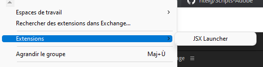
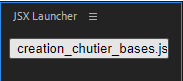

# Scripting Adobe

## Création d'arborescence de chutier 

* Pour utiliser des scripts sur Adobe Première Pro, installer l'extension JSX Launcher depuis l'application creative cloud
* Ensuite télècharger le fichier creation_chutier_bases.jsx et le mettre dans un dossier, puis en démarant Premiere pro, lancer l'extension en selectionnant ce dossier, et vous n'aurez plus qu'à appuyer sur creation_chutier_bases.jsx

## Liens utiles

* https://medium.com/adobetech/extendscript-debugger-for-visual-studio-code-public-release-a2ff6161fa01
* https://ppro-scripting.docsforadobe.dev/index.html
